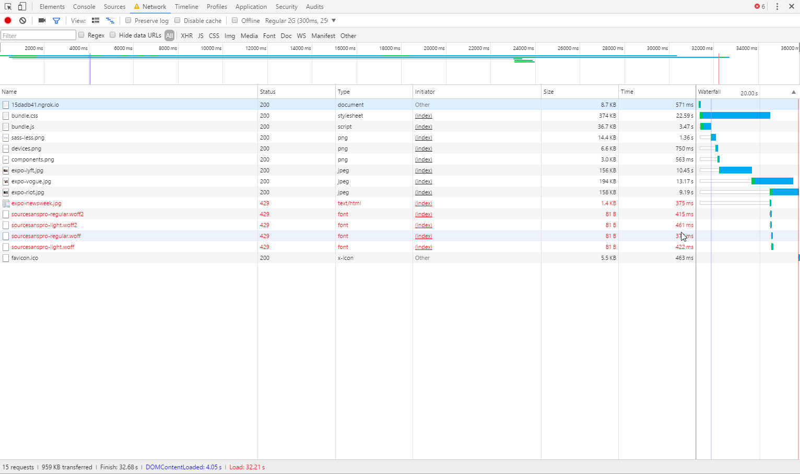

# Performance matters

## Project setup

This project serves an adapted version of the [Bootstrap documentation website](http://getbootstrap.com/). It is based on the [github pages branche of Bootstrap](https://github.com/twbs/bootstrap/tree/gh-pages). 

Differences from actual Bootstrap documentation:

- Added custom webfont
- Removed third party scripts
- The src directory is served with [Express](https://expressjs.com/).
- Templating is done with [Nunjucks](https://mozilla.github.io/nunjucks/)

## Getting started

- Install dependencies: `npm install`
- Serve: `npm start`
- Expose localhost: `npm run expose`

## Before any optimizations
All testing is done on regular 2G network throttling using Chrome dev tool. 

## After Clean/Concast CSS
It got worse. The base pagespeed insight score was 46/100 for desktop and after this it went to 45. But I decided to keep them and went on with the next optimizations.

## After uglify js and bundling the JS files
score is now 47/100.

## After image optimization
I did some image compressing and the speed wen up slightly. Score is now 57/100 & 59/100. 

On top of that I also added webp to the images using a fallback to the compressed images. Using webp makes a significant difference. The ssore is now 56/100 & 65/100.

## After FontFaceObserver
After using the plugin, we get a score of 66/100 & 74/100. Besides that, we also store the new class in sessionStorage, so when the user reloads or goes to another page the font is known and we don't have to wait for it to load. Making the browsing experience a bit quicker and This eliminates FOIT("Flash of Invisible Text")

## Critical CSS
I generated a critical css using [this site](https://jonassebastianohlsson.com/criticalpathcssgenerator/). The docs.css from the assets is now added as critical CSS to the inline in the <head>. I think it works as the pagespeeed insight score is now 66/100 & 75/100.

## After applying loadCSS
When throttling the cconnection to 2G (300ms), we see that the page loads way faster than without it. But the iniitial page doesnt look good because the nav is in the bootstrap.css folder, which we dont have in the critical CSS. We need to manually move that part of the code to the critical CSS for the page to look good, but I think it's worth it. Pagespeed Insight score is now: 92/100 & 86/100.

## Final optimizations
After Gzipping and modifying the critical CSS, and putting the fontfaceobserver down at the bottom of the body I finaly got the 100/100 score. Web Page Test gives different results but I have records of the tests I've ran.

## Result 

Timeline:
- 

Pagespeed Insights:

Network on regular 2G:

